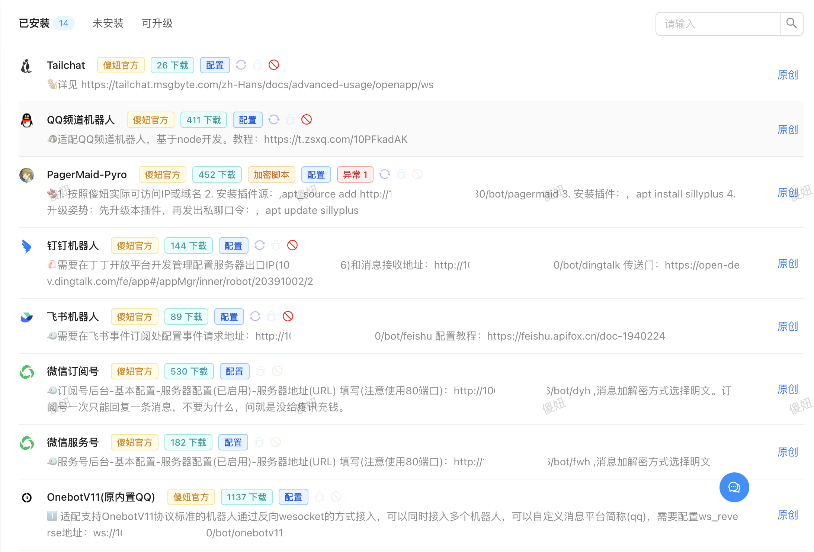
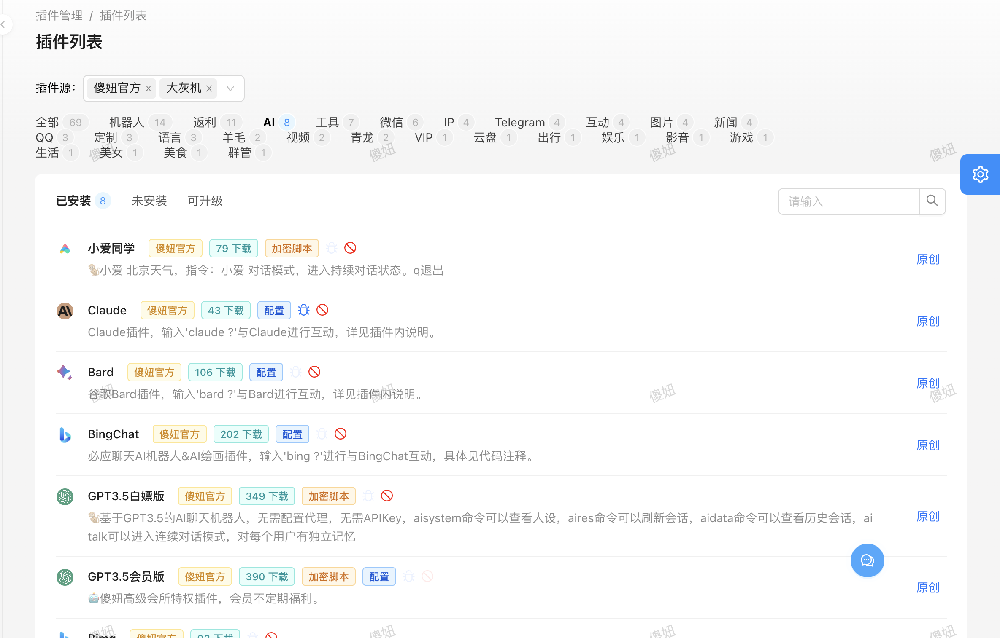
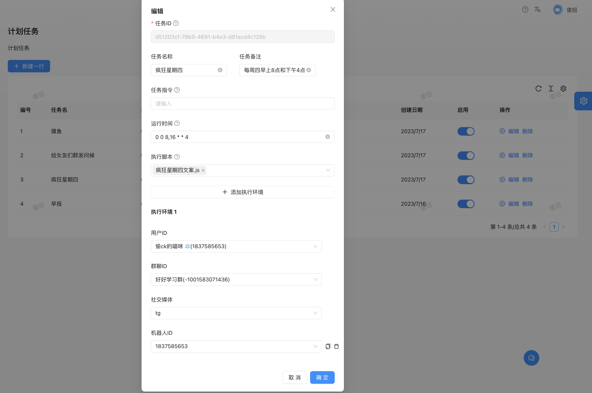

<h1 align="center">傻妞</h1>
<div align="center">
<font size=3> 支持多种开发语言的机器人框架，一个脚本即可实现跨平台的用户交互.</font>

<font size=4>一个不太有用的机器人，我愿称之为 **《废物》**.</font>

[开发文档](https://cdle.github.io/sillyGirl) | [Github](https://github.com/cdle/sillyGirl) | [TG 频道](https://t.me/kczz2021) | [赞助列表](./sponsors.md)

\_

</div>

> **傻妞 是一个开箱即用的 社交平台交互 框架。它基于 OOP 函数响应式编程，具有占用小、响应快、开发易等特点，允许开发者创建高度可测试、可扩展、松散耦合且易于维护的应用程序**

# 特性

- 多平台多账户接入系统 ： 2 个 qq/3 个 wx/4 个 tg? so easy!；
  - 用户可以前往插件市场，一键安装自己想要接入聊天工具，只需简单配置即可使用
    
  - 开发者可以通过 Adapter 自由接入聊天工具，以下是接入`tailchat`的简单插件例子

```javascript
/**
 * @title Tailchat
 * @create_at 2023-08-05 21:16:32
 * @description 🐒配置详见 https://tailchat.msgbyte.com/zh-Hans/docs/advanced-usage/openapp/ws
 * @author 猫咪
 * @version v1.0.3
 * @form {key: "tailchat.APPID", title: "APP ID", required: true }
 * @form {key: "tailchat.APPSECRET", title: "APP SECRET", required: true }
 * @form {key: "tailchat.HOST", title: "HOST", required: true, tooltip: "服务器http地址" }
 * @service true
 * @icon https://tailchat.msgbyte.com/zh-Hans/img/logo.svg
 * @public true
 * @class 机器人
 */

const {
  Bucket,
  utils: { parseCQText },
  Adapter,
} = require("sillygirl");
const { URL } = require("url");

(async () => {
  const platform = "tailchat";
  const config = new Bucket(platform);
  const { TailchatWsClient } = require("tailchat-client-sdk");

  let HOST = await config.get("HOST");
  let APPID = await config.get("APPID");
  let APPSECRET = await config.get("APPSECRET");

  const parsedUrl = new URL(HOST);
  HOST = `${parsedUrl.protocol}//${parsedUrl.host}`;

  if (!HOST || !APPID || !APPSECRET) {
    console.error("require param: HOST, APPID, APPSECRET");
    process.exit(1);
  }

  const client = new TailchatWsClient(HOST, APPID, APPSECRET);

  client.connect().then(async () => {
    const bot_info = await client.whoami();
    const adapter = new Adapter({
      platform, //平台简称
      bot_id: bot_info.userId, //机器人ID
      replyHandler: async ({ content, chat_id: converseId, groupId }) => {
        client.sendMessage({ converseId, groupId: groupId ?? "", content }); //往社交平台发送消息
      },
    }); // 初始化适配器
    client.onMessage(({ content, author: user_id, groupId, converseId }) => {
      adapter.receive({
        user_id,
        chat_id: converseId,
        content,
        groupId,
      }); //向框架发送消息
    });
  });
})();
```

- 基于 Golang OOP 函数响应式编程 ：占用小，响应快，开发易 ；
- 极简的插件设计模式：
  - 系统高度封装，提供简便人性化的系统方法，随心所欲开发插件；
  - 用户可以无感安装插件，免去部署环境等繁琐操作；
  
  - 插件支持热重载，无需重启程序。作为开发者，可以即时的进行调试。作为用户，配置完插件参数后也将触发热重载。
- 通过计划任务轻松实现早报推送、定时提醒喝茶和群发问候等功能；
  
- 支持多种插件开发语言 ：
  - 内置 Javascript 引擎，完整支持 ECMAScript 5.1，快速、便捷、门槛低；
  - 支持 NodeJs，尽情使用其提供的 async/await/Promise 语法糖，可以自由控制异步同步；
  - 支持 Python3，简洁明了的语法、强大的标准库以及社区优势；
  - 即将支持 PHP，对对对，这是世界上最好的语言；
- 不仅仅是 Chat RoBot ： 如果你愿意，可以在本框架上搭建网站、图片服务器、资源共享平台、并发请求等服务，尽情释放你的创造力.

# 未来

- [ ] ...

> 后台目前只有一个蹩脚的前端(本人),如果有前端工程师对此感兴趣,请联系我~

# 安装

参见 [安装文档](./md/init.md)

# 开发

[开发文档](https://cdle.github.io/sillyGirl)

> 如果是手机端浏览开发文档，请点击开发文档左下角的按钮手动打开侧边栏目录。

> 如果你是纯小白可以了解 [内置JS引擎](./md/goja.md)，快速进行插件开发

# 其他

[Github](https://github.com/cdle/sillyGirl)
[TG 频道](https://t.me/kczz2021)
[TG 群组](https://t.me/trialerr)
[赞助列表](./sponsors.md)

## 请喝茶 ?

[联系到我](https://t.me/cdle1994)
您的支持是我更新的动力,Thank~

## 免责声明

> 任何用户在使用由 Cdle（以下简称「本团队」）研发的机器人框架傻妞前，请您仔细阅读并透彻理解本声明。您可以选择不使用傻妞框架，若您一旦使用傻妞框架，您的使用行为即被视为对本声明全部内容的认可和接受。

1. 傻妞框架是一款免费的机器人框架，主要用于更高效地开发会话应答式程序。且傻妞框架并不具备「互联网接入、网络数据存储、通讯传输以及窃取用户隐私」中的任何一项与用户数据等信息相关的动态功能。
2. 傻妞框架仅是运行 Golang/Node/Python 等程序的服务端框架，其尊重并保护所有用户的个人隐私权，不窃取任何用户计算机中的信息。更不具备用户数据存储等网络传输功能。
3. 本框架的初衷是帮助广大同学认识 Golang，并更好利用 Golang 进行学术研究，用户在框架上做的所有改动、开发的任何插件均与本框架无关。
4. 本框架内使用的部分包括但不限于字体、npm 库等资源来源于互联网，如果出现侵权可联系本框架移除。
5. 由于使用本框架产生的包括由于本协议或由于使用或无法使用本框架而引起的任何性质的任何直接、间接、特殊、偶然或结果性损害（包括但不限于因商誉损失、停工、计算机故障或故障引起的损害赔偿，或任何及所有其他商业损害或损失）由使用者负责。
6. 您承诺秉着合法、合理的原则使用傻妞框架，不利用傻妞框架进行任何违法、侵害他人合法利益等恶意的行为，亦不将傻妞框架运用于任何违反我国法律法规的 Web 平台。
7. 任何单位或个人因下载使用傻妞框架而产生的任何意外、疏忽、合约毁坏、诽谤、版权或知识产权侵犯及其造成的损失 (包括但不限于直接、间接、附带或衍生的损失等)，本团队不承担任何法律责任。
8. 用户明确并同意本声明条款列举的全部内容，对使用傻妞框架可能存在的风险和相关后果将完全由用户自行承担，本团队不承担任何法律责任。
9. 任何单位或个人在阅读本免责声明后，应在法律所允许的范围内进行合法的发布、传播和使用傻妞框架等行为，若违反本免责声明条款或违反法律法规所造成的法律责任(包括但不限于民事赔偿和刑事责任），由违约者自行承担。
10. 传播:任何公司或个人在网络上发布,传播我们框架的行为都是允许的,但因公司或个人传播框架可能造成的任何法律和刑事事件框架作者不负任何责任。
11. 本团队对傻妞框架拥有知识产权（包括但不限于商标权、专利权、著作权、商业秘密等），上述产品均受到相关法律法规的保护。
12. 任何单位或个人不得在未经本团队书面授权的情况下对傻妞框架本身申请相关的知识产权。
13. 如果本声明的任何部分被认为无效或不可执行，则该部分将被解释为反映本团队的初衷，其余部分仍具有完全效力。不可执行的部分声明，并不构成我们放弃执行该声明的权利。
14. 本团队有权随时对本声明条款及附件内容进行单方面的变更，并以消息推送、网页公告等方式予以公布，公布后立即自动生效，无需另行单独通知；若您在本声明内容公告变更后继续使用的，表示您已充分阅读、理解并接受修改后的声明内容。
15. 本仓库部分开已开源代码遵循 MIT 开源许可协议。
