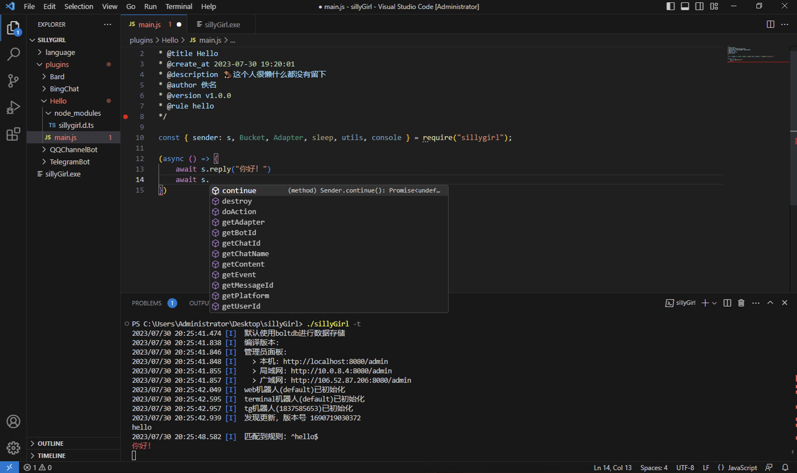

> - 傻妞 是一个 支持Node、Python 机器人框架，开发需要有一定的编程基础，以下主要对Node进行讲解，其他语言类似。

# 开发环境搭建

## 通过 vscode 开发

- 打开 plugins 目录
- 运行傻妞 `./sillyGirl -t`,在这里你可以直接输入信息调试、以及观察 console.log 输出信息、收发消息情况等信息
- 开发插件非常方便~
   本人开发插件示例

## 文件目录说明

- 插件开发

  - plugins 下只有二级目录下的 index.js 作为入口文件才会被尝试载入，根目录以及 3 级以下不会加载，示例 ：

    ```
    plugins/hello/index.js  //会被当做插件载入
    plugins/index.js  //忽略
    ```

  - 重载：plugins 下的所有文件都是保存既重载
  - 默认识别为 Node 开发语言，否则请在插件目录加上 `py_` 、`php_` 前缀
  - 内置的 JS 引擎仅支持在后台管理开发面板中进行开发

- language

  - 存放语言支持的一些依赖，请不要动它。当然目前只有`node`、`python`

# 模块方法介绍

## async sleep

Node 休眠(阻塞运行),传 number,注意单位是毫秒

```javascript
//内置js
time.sleep(5000);
```

```javascript
//node
await sleep(5000);
```

```python
#python
await asyncio.sleep(5)
```

## utils 工具包

### buildCQTag 拼接 CQ 码

本项目消息机遇字符串，图片和视频等通过 CQ 码实现，因此提供了拼接方法

```
/**
 * @author 猫咪
 * @origin 傻妞官方
 * @version v1.0.0
 * @create_at 2022-09-08 07:31:42
 * @title 二维码
 * @rule 二维码 ?
 * @description 🐒生成指定内容的一个二维码。
 * @public true
 * @icon https://bpic.51yuansu.com/pic3/cover/02/70/77/5a1878243d237_610.jpg
 * @class 图片
 */
```

```js
//内置js
let url = `https://api.pwmqr.com/qrcode/create/?url=${encodeURIComponent(s.param(1))}`;
s.reply(strings.buildCQTag("image", { url }));
//等价写法
s.reply(image(url));
```

```js
//node
const {
  sender: s,
  utils: { buildCQTag, image },
} = require("sillygirl");

(async () => {
  let url = `https://api.pwmqr.com/qrcode/create/?url=${encodeURIComponent(
    await s.param(1)
  )}`;
  await s.reply(buildCQTag("image", { url }));
  //等价写法
  await s.reply(image(url));
})();
```

```python
#python
from sillygirl import sender as s, utils
from urllib.parse import quote
import asyncio

async def main():
  url = f"https://api.pwmqr.com/qrcode/create/?url={quote(await s.param(1))}"
  await s.reply(utils.buildCQTag("image", { url }))
  #等价写法
  await s.reply(utils.image(url))

loop = asyncio.get_event_loop()
loop.run_until_complete(main())
```

### parseCQText 解析 CQ 码

```js
/**
 * @title 钉钉机器人
 * @create_at 2023-07-03 08:07:43
 * @description 🐔钉钉机器人适配器。
 * @author 佚名
 * @version v1.0.3
 * @public true
 * @class 机器人
 * @service true
 */

const {
  utils: { parseCQText },
} = require("sillygirl");

(async () => {
  let adapter = new Adapter({
    platform: "dingtalk",
    bot_id: wsdata.msg.user.id,
    replyHandler: async ({ user_id, chat_id, content }) => {
      for (let item of parseCQText(content)) {
        if (typeof item == "string") {
          // item 此时是文本，执行发送文本消息逻辑
        }
        if (item.type == "image") {
          let url = item.params.url;
          // url 是图片链接，执行发送图片消息逻辑
        }
        if (item.type == "video") {
          let url = item.params.url;
          // url 是视频链接，执行发送视频消息逻辑
        }
      }
      return "${message_id}";
    },
  });
})();
```

### utils.npmInstall 安装 npm 包 (待实现)

```js
await utils.npmInstall("request"); //会返回执行信息String
await utils.npmInstall("request", { outConsole: true }); // 将会在控制台实时打印安装情况，返回结果为null
```

### utils.testModule 测试 npm 包是否存在 (待实现)

```js
await utils.testModule(["telegram", "input"]); //将只测试，返回结果
await utils.testModule(["telegram", "input"], { install: true }); //发现少模块自动安装
```

## Adapter 适配器构造类

- 具体使用方法参见适配器开发

## Bucket 数据库构造类

系统数据库为轻量型内嵌式 KV 数据库。

开发插件时，你可以使用任意你喜欢的数据库来存放数据 （不建议，会破坏用户使用体验）

有关数据库操作，你可以在官方插件中找到全部用法示例

> Linux 存放于 `/etc/sillyplus`

> Windows 存放于 `C:\ProgramData\sillyplus`

> Darwin 存放于 `.sillyplus`

> 建议定期备份

### get()获取数据

该方法接受二个参数

- 需要读取的 key
- 未读取到值默认返回值（可选）

```javascript
//内置js
const test = new Bucket("test");
//读取一个key的 value 值 如果没有该数据返回undefined
consoloe.log(test.name1)// undefined
consoloe.log(test["name1"])// undefined
// 第二个参数作为未读取到数据的返回值
test.get("name1", "阿明")// 阿明
```

```javascript
//node
const test = new Bucket("test");
await test.get("name1");
await test.get("name1", "阿明");
```

```python
#python
test = Bucket("test")
await test.get("name1") #None
await test.get("name1", "阿明")

#支持同步，小心阻塞watch方法
print(test.name1) #None
test.name1 = "阿明"
print(test.name1)
```

### set()存储数据

该方法接受三个参数

- 需要设置的 key
- 需要设置的 value

```javascript
//创建一个测试数据库实例
const test = new Bucket('test');

const {
    changed // boolean 实际值是否变更
    message // string 修改回调消息，修改可能被变更或拦截
    error // string 修改失败时的错误消息
} = await test.set('name', '阿明');
```

### delete()删除数据

该方法接受一个参数

- 需要删除的 key

返回结果同 set

### getAll() 读取所有键值对

### empty() 清空数据库

### keys()读取所有 key 返回一个 Array

返回一个字符串数组

### watch() 监听数据变更，可进行拦截、修改

```python
# python
from sillygirl import Bucket
import asyncio

test = Bucket("test")

async def main():
    async def handle(old_value, new_value, key):
        print("Bucket value changed!")
        print("Key:", key)
        print("Old value:", old_value)
        print("New value:", new_value)
        new_value = f"new {new_value}"
        print("New New value:", new_value)
        return {
            "now": new_value,
            #"error": "具体错误，将会撤销修改"
            #"message": "携带的额外信息"
        }

    test.watch("*", handle)
    await asyncio.Queue().get()
loop = asyncio.get_event_loop()
loop.run_until_complete(main())
```

# 适配器开发

## 元信息配置

通过 jsdoc 注释的方式来定义元信息，service true 时，将随程序一起执行

```javascript
/**
 * @service true
 */
```

## 初始化一个适配器

基本使用方法：

```
/**
 * @title 钉钉机器人
 * @create_at 2023-07-30 11:09:12
 * @description 🐒钉钉机器人适配器。
 * @author cdle
 * @version v1.0.0
 * @service true
 */
```

```javascript
//node
const { Adapter, sleep } = require("sillygirl");

const bot_id = "";
const platform = "dingtalk";

const dingtalk = new Adapter({
  platform,
  bot_id,
  // 处理 Sender.reply 回复的消息
  replyHandler: ({
    user_id, //用户ID
    chat_id, //群聊ID，为什么不用group_id，因为本人觉得别扭、不对齐
    message_id, //消息ID
    content, //消息内容，其中图片、文本使用CQ码实现
    //... 自定义参数，来自 Adapter.receive
  }) => {
    //... 实际消息发送逻辑
    return "${message_id}"; //返回消息ID，用于消息撤回等处理
  },
  // 处理 Sender.doAction 发出的指令
  actionHandler: (
    {
      //... 系列参数，如删除消息:{ type: "delete_message", message_id }
    }
  ) => {
    return "${action_result}"; //返回结果
  },
});

//向框架内部发送信息
dingtalk.receive({
  user_id: "用户ID",
  chat_id: "群聊ID",
  message_id: "消息ID",
  content: "消息内容",
  //以下为可选
  user_name: "用户名", //用户名称
  chat_name: "群聊名名", //群聊名称
  //... 自定义参数
});

//向框架外部推送消息，无视 unreply
dingtalk.push({
  ser_id: "用户ID",
  chat_id: "群聊ID",
  message_id: "消息ID",
  content: "消息内容",
});

//获取 sender 实例
const ns = dingtalk.sender({
  user_id: "用户ID",
  chat_id: "群聊ID",
  message_id: "消息ID",
  content: "消息内容",
});

// 1秒后主动销毁适配器，会抛出异常注意捕获
// sleep(1000).then(() => {
//   dingtalk.destroy();
// });
```

```python
#python
from sillygirl import Adapter, console
async def main():
    def replyHandler(message):
        console.log("message", message)
        return "ok"
    bot = Adapter(platform="terminal2", bot_id="default", replyHandler=replyHandler)
    ns = await bot.sender({"user_id": "user_id"})
    console.log(await ns.reply("hello"))
    # await bot.destroy()
    await asyncio.sleep(10)
```

# 插件开发

## sender 方法合集

开发插件前,我们先了解一下 sender,该方法只有在插件中可用

### 导入 sender 为 s

```js
/**
 * @rule Hello ?
 */

const { sender: s } = require("sillygirl");
```

### sender.getUserId() 获取用户 id

```js
//内置js
console.log(s.getUserId())
```

```js
//node
s.getUserId().then((user_id) => console.log(`用户ID：${user_id}`));
```

```python
#python
print(await s.getUserId())
```

### sender.getChatId() 获取群聊 id

```js
s.getChatId().then((chat_id) => console.log(`群聊ID：${chat_id}`));
```

### sender.getMessageId() 获取消息 id

```js
s.getMessageId().then((message_id) => console.log(`消息ID：${message_id}`));
```

### sender.getContent() 获取消息内容

```js
s.getContent().then((content) => console.log(`消息内容：${content}`));
```

### sender.param() 获取参数，对应元消息中的 rule 中子匹配

```js
s.param(1).then((param1) => console.log(`参数1：${param1}`));
```

### sender.reply() 回复消息

```js
s.reply("你好").then((message_id) => console.log(`消息ID：${message_id}`));
```

### sender.listen() 监听消息

#### 例 1

```js
(async () => {
  await s.reply("请输入11位手机号：");
  let s2 = await s.listen({
    rules: ["^\\d{11}$"],
  });
  let phone = await s2.getContent();
  await s.reply(`你的手机号码是：${phone}`);
  //... 业务逻辑
})();
```

#### 例 2

```js
(async () => {
  await s.reply("请在10秒内输入11位手机号：");
  let s2 = await s.listen({
    rules: ["^\\d{11}$"],
    timeout: 10000,
  });
  if (!s2) {
    await s.reply("输入超时！");
  } else {
    let phone = await s2.getContent();
    await s.reply(`你的手机号码是：${phone}`);
    //... 业务逻辑
  }
})();
```

### sender.holdOn() 继续监听消息

#### 例 3

```js
(async () => {
  await s.reply("请在10秒内输入11位手机号：");
  let phone = "";
  await s.listen({
    handle: async (s) => {
      phone = await s.getContent();
      if (phone.length != 11) {
        return s.holdOn("错误，请重新输入(直到正确)：");
      } else {
        return "输入正确。";
      }
    },
  });
  await s.reply(`你的手机号码是：${phone}`);
  //... 业务逻辑
})();
```

### sender.doAction() 发起指令

#### 撤回消息

```js
(async () => {
  const { sleep } = require("sillygirl");
  let message_id = await s.reply("本消息3秒后撤回！");
  await sleep(3000);
  await s.doAction({
    type: "delete_message",
    message_id,
  });
})();
```

### sender.getEvent() 获取事件

### sender.isAdmin() 是否管理员消息

```javascript
sender.isAdmin().then((bool) => console.log(`${bool ? "是" : "不是"}管理员。`));
```

### sender.getUserName() 获取用户昵称

```javascript
s.getUserName().then((user_name) => console.log(user_name));
```

### sender.getChatName() 获取群聊昵称

```javascript
s.getChatName().then((v) => console.log(v));
```

### sender.getPlatform() 获取消息平台

```javascript
s.getPlatform().then((v) => console.log(v));
```

### sender.getBotId() 获取机器人 id

```javascript
s.getBotId().then((v) => console.log(v));
```

### sender.getAdapter() 获取适配器

```javascript
s.getAdapter().then((adapter) => console.log(adapter););
```

### sender.continue() 消息继续向下传递

### sender.setContent() 篡改消息内容

### sender.destroy() 销毁会话，

脚本结束后自动调用，如果脚本长期不结束需要用手动调用避免内存泄漏

## 元信息配置

```js
/**作者
 * @author Cdle
 * 插件名
 * @name 日常命令
 * 组织名
 * @origin 傻妞官方
 * 版本号
 * @version 1.0.5
 * 说明
 * @description 🐷日常命令，个人认为会比较便捷
 * 限制平台 不在该范围内的平台消息该插件不会被触发
 * @platform tg qq
 * 触发正则，^开头或raw 开头
 * @rule ^你好 ([^\n]+)$
 * @rule raw 你好
 * 直接用问号代替要匹配的内容
 * @rule 你好 ?
 * 使用方括号代替要匹配的内容，s.param("姓名") 取参
 * @rule 你好 [姓名]
 * 参数名加?表示为选值
 * @rule 你好 [姓名?]
 * // 是否管理员才能触发命令
 * @admin true
 * // 是否发布插件
 * @public false
 * // 插件优先级，越大优先级越高  如果两个插件正则一样，则优先级高的先被匹配
 * @priority 9999
 * // 是否禁用插件
 * @disable false
 * // 每5小时运行一次插件，触发时 platform 为 cron
 * @cron 0 0 *\/5 * * *
 * // 是否服务模块，会在系统启动时执行该插件内容，触发时 platform 为 *
 * @service false
 * // 给插件设置一个好看的头像
 * @icon https://wx.zsxq.com/dweb2/assets/images/favicon_32.ico
```

## 写一个简单的 hello world

```js
/**作者
 * @author Cdle
 * @name Hello
 * @version 1.0.5
 * @description 你好，世界！
 * @rule [参数1:hello,你好] [参数2]
 * @admin false
 * @public false
 * @priority 1
 * @disable false
 */

(async (s) => {
  let name = await s.param("参数2");
  await s.reply(`你好，我是${name}`);
})();
```

## 插件加密(暂未实现)

为保护开发者知识产权，如果不想公开插件源码，可以用块级注释来包裹需要加密的内容
`/*hidden*/` 开始，`/*neddih*/`结束，必须严格按照要求，多/少空格都不会被识别到

```js
/*hidden*/
let key = 1234;
/*neddih*/

console.log("key");
```

到底啦~ 详细的开发还是要靠插件来说明,多看看官方插件吧~~
